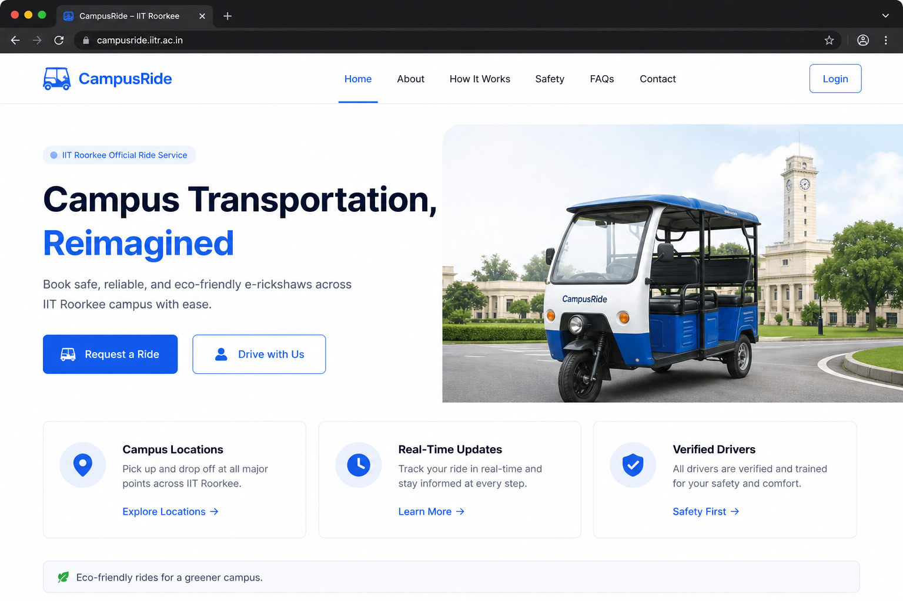
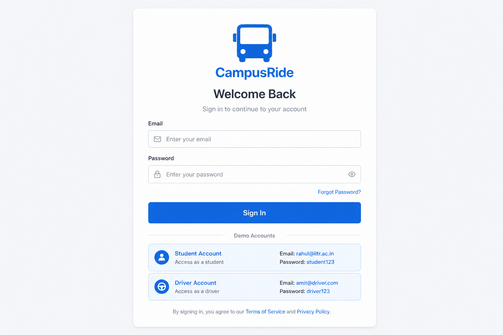
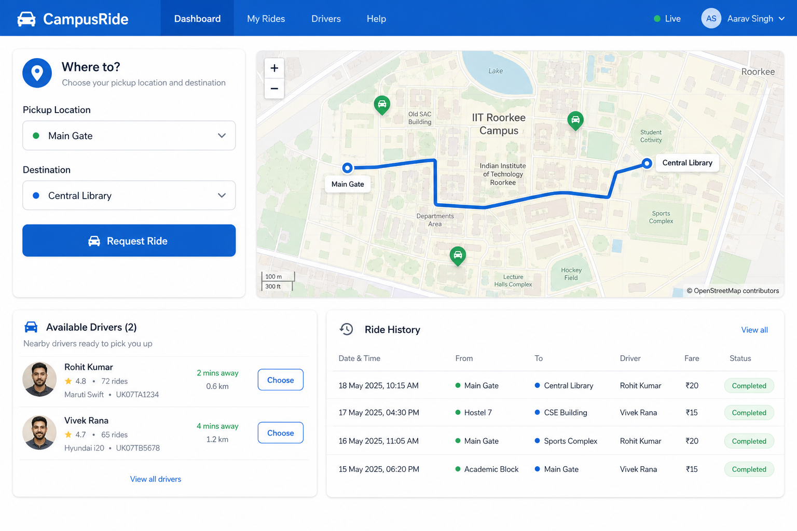
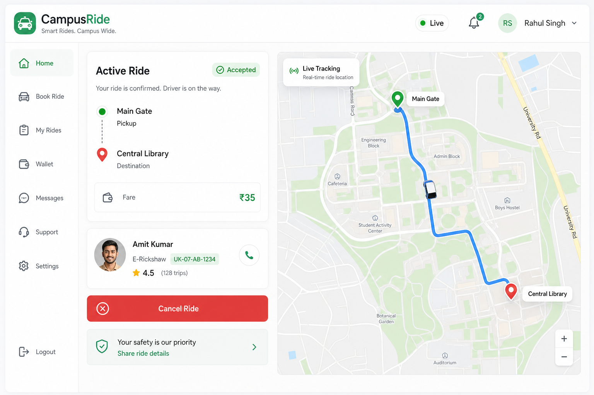
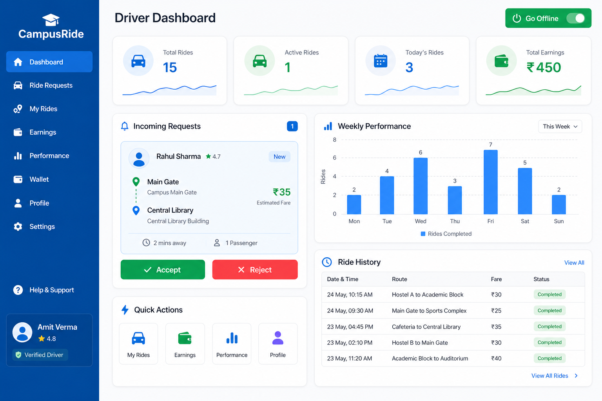

# CampusRide - Real-Time Campus Mobility Platform

[](https://campus-mobility.vercel.app)
[](LICENSE)

> A full-stack real-time ride management platform connecting passengers and e-rickshaw drivers across IIT Roorkee campus.

**[Live Demo](https://campus-mobility.vercel.app)** | [Design Document](docs/DESIGN_DOCUMENT.md)

---

## Project Overview

CampusRide is a campus-scale mobility platform that enables passengers to request rides and drivers to accept them in real time. Built for the IIT Roorkee campus environment, it addresses fragmented transportation coordination through a centralized digital system with WebSocket-powered live updates.

### Key Highlights
- Real-time ride updates via **Socket.IO**
- JWT-based authentication for passengers and drivers
- Live campus map with **OpenStreetMap** and **Leaflet**
- Driver dashboard with analytics and charts
- Ratings and feedback system
- Atomic ride assignment (no double-booking)

---

## Live Demo

**URL:** [https://campus-mobility.vercel.app](https://campus-mobility.vercel.app)

### Demo Accounts

| Role      | Email               | Password    |
|-----------|---------------------|-------------|
| Passenger | rahul@iitr.ac.in    | password123 |
| Passenger | priya@iitr.ac.in    | password123 |
| Driver    | amit@driver.com     | password123 |
| Driver    | suresh@driver.com   | password123 |

> Open two browser windows (one passenger, one driver) to test the full real-time ride workflow.

---

## Screenshots

### Landing Page


### Login


### Passenger Dashboard


### Active Ride Tracking


### Driver Dashboard


---

## Technology Stack

| Category   | Technologies |
|------------|--------------|
| Frontend   | React 18, Vite, Tailwind CSS, React Router, Leaflet, Recharts |
| Backend    | Node.js, Express.js, Socket.IO |
| Database   | MongoDB, Mongoose |
| Auth       | JWT (JSON Web Tokens), bcryptjs |
| Real-time  | WebSocket via Socket.IO |
| Maps       | OpenStreetMap, Leaflet, React-Leaflet |
| Deployment | Vercel (frontend), Render (backend) |

---

## Features

### Mandatory Features
- [x] **User Authentication** - Registration, login, profile management (JWT)
- [x] **Driver Onboarding** - Vehicle info, license verification
- [x] **Driver Availability** - Go online/offline, view available drivers
- [x] **Ride Request Workflow** - Request, accept, reject rides
- [x] **Real-Time Updates** - Live status via Socket.IO
- [x] **Ride Lifecycle** - Requested → Accepted → In Progress → Completed/Cancelled
- [x] **Driver Dashboard** - Stats, charts, ride history, ratings
- [x] **Ratings & Feedback** - Rate completed rides with optional feedback

### Bonus Features
- [x] **Live Map Integration** - OpenStreetMap with driver markers and routes
- [x] **Demand Analytics** - Peak hours and popular pickup locations API

---

## Project Structure

```
campus-mobility-platform/
├── backend/
│   ├── src/
│   │   ├── config/        # Database configuration
│   │   ├── models/        # User & Ride schemas
│   │   ├── routes/        # REST API routes
│   │   ├── middleware/    # JWT auth middleware
│   │   ├── socket/        # Socket.IO handlers
│   │   ├── utils/         # Helpers & campus locations
│   │   ├── server.js      # Entry point
│   │   └── seed.js        # Demo data seeder
│   └── package.json
├── frontend/
│   ├── src/
│   │   ├── components/    # Reusable UI components
│   │   ├── context/       # Auth & Socket providers
│   │   ├── pages/         # Route pages
│   │   └── services/      # API client
│   └── package.json
├── docs/
│   └── DESIGN_DOCUMENT.md
├── screenshots/
├── README.md
└── package.json
```

---

## Setup Instructions

### Prerequisites
- **Node.js** 18+ ([Download](https://nodejs.org/))
- **MongoDB** ([Local](https://www.mongodb.com/try/download/community) or [Atlas](https://www.mongodb.com/atlas))
- **Git**

### 1. Clone the Repository

```bash
git clone https://github.com/YOUR_USERNAME/campus-mobility-platform.git
cd campus-mobility-platform
```

### 2. Install Dependencies

```bash
npm run install:all
```

### 3. Configure Environment

**Backend** (`backend/.env`):
```env
PORT=5000
MONGODB_URI=mongodb://localhost:27017/campus-mobility
JWT_SECRET=your-super-secret-jwt-key
CLIENT_URL=http://localhost:5173
NODE_ENV=development
```

**Frontend** (`frontend/.env`):
```env
VITE_API_URL=http://localhost:5000/api
VITE_SOCKET_URL=http://localhost:5000
```

### 4. Seed Demo Data

```bash
npm run seed
```

### 5. Run the Application

**Terminal 1 - Backend:**
```bash
npm run dev:backend
```

**Terminal 2 - Frontend:**
```bash
npm run dev:frontend
```

Open [http://localhost:5173](http://localhost:5173) in your browser.

---

## Running the Application

| Service  | URL                          | Port |
|----------|------------------------------|------|
| Frontend | http://localhost:5173        | 5173 |
| Backend  | http://localhost:5000        | 5000 |
| API      | http://localhost:5000/api    | 5000 |
| Health   | http://localhost:5000/api/health | 5000 |

---

## Deployment

### Frontend (Vercel)
1. Push repo to GitHub
2. Import project on [Vercel](https://vercel.com)
3. Set environment variables:
   - `VITE_API_URL` = your Render backend URL + `/api`
   - `VITE_SOCKET_URL` = your Render backend URL

### Backend (Render)
1. Create a Web Service on [Render](https://render.com)
2. Use `render.yaml` or set:
   - Build: `cd backend && npm install`
   - Start: `cd backend && npm start`
3. Set environment variables: `MONGODB_URI`, `JWT_SECRET`, `CLIENT_URL`

### MongoDB Atlas
1. Create a free cluster at [MongoDB Atlas](https://www.mongodb.com/atlas)
2. Copy connection string to `MONGODB_URI`
3. Run seed script once after deployment

---

## API Endpoints

| Method | Endpoint | Description |
|--------|----------|-------------|
| POST | `/api/auth/register` | Register user |
| POST | `/api/auth/login` | Login |
| GET | `/api/auth/me` | Current user |
| POST | `/api/rides` | Request ride |
| PATCH | `/api/rides/:id/accept` | Accept ride |
| PATCH | `/api/rides/:id/start` | Start ride |
| PATCH | `/api/rides/:id/complete` | Complete ride |
| POST | `/api/rides/:id/rate` | Rate ride |
| GET | `/api/drivers/dashboard` | Driver analytics |
| GET | `/api/drivers/available` | Online drivers |

Full API documentation: [docs/DESIGN_DOCUMENT.md](docs/DESIGN_DOCUMENT.md)

---

**Built with ❤️ to optimize campus mobility 2026**

*A robust, full-stack carpooling system built to solve the challenges of inter-campus commuting. This project demonstrates high-concurrency handle, real-time map integration, and efficient matching algorithms. Perfect for showcasing backend scalability and end-to-end full-stack development.*

** Made by Bhukya Naresh **

---

## License

This project is licensed under the MIT License - see the [LICENSE](LICENSE) file for details.
